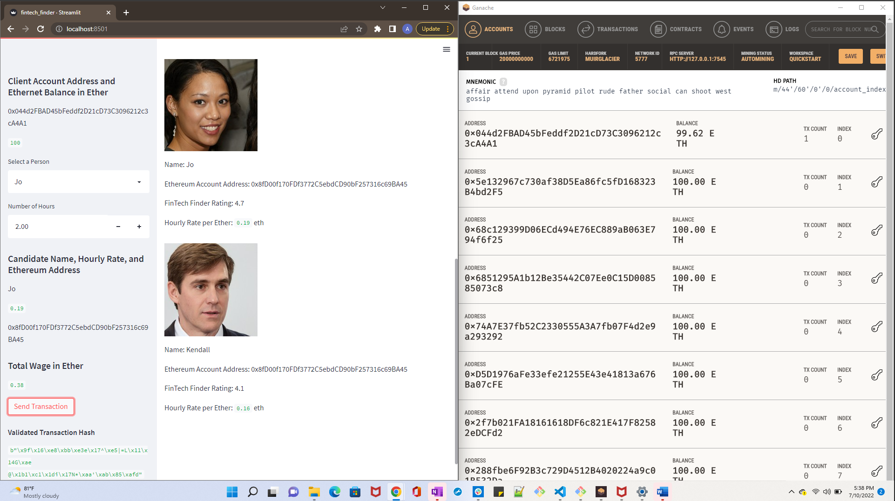
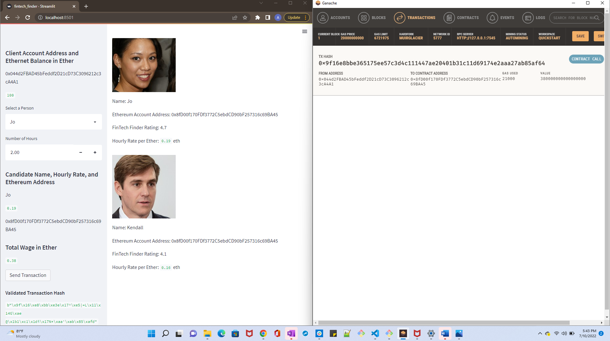

# Crypto-Wallet

## Send a test transaction by using the application’s web interface, and then
## look up the resulting transaction hash in Ganache.

### Complete the following steps:

1. Open a new instance of Ganache and save the Mnemonic phrase to the variable
"MNEMONIC" in a .env file in the project folder.

2. From your terminal, navigate to the project folder that contains
your `.env` file and the `fintech_finder.py` and `crypto_wallet.py` files.
Be sure to activate your Conda `dev` environment if it is not already active.

3. To launch the Streamlit application,
type `streamlit run fintech_finder.py`.

4. On the resulting webpage, select a candidate that you would like to hire
from the appropriate drop-down menu. Then, enter the number of hours that you
would like to hire them for. (Remember, you do not have a lot of ether in
your account, so you cannot hire them for long!)

5. Click the Send Transaction button to sign and send the transaction with
your Ethereum account information. If the transaction is successfully
communicated to Ganache, validated, and added to a block,
a resulting transaction hash code will be written to the Streamlit
application sidebar.

6. Navigate to the Ganache accounts tab and locate your account (index 0). 
You should see the balance update based on the transaction amount you sent
in the Streamlit app. You will also see the TX Count update as you perform 
transactions. It should look similar to the image below.

7. Navigate to the Ganache transactions tab and locate the transaction history
to see full hash of sender and recipient, gas used, and value in wei for each
transaction. It looks something like this. 

